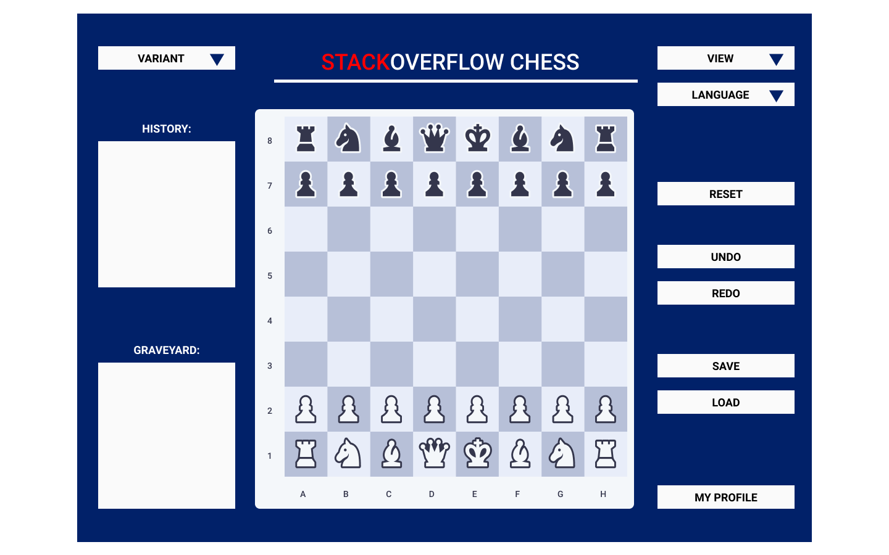

> Write your planned design without revealing any specific implementation details (like data structures, file formats, etc.). Start by describing the primary design goals of the project (i.e., where is it most flexible) and the primary architecture of the design (i.e., what is closed and what is open) — this should emphasize your game genre's important commonalities and how they could be represented by abstractions. Describe your intended design to handle your team's goals for the project functionality using APIs to provide services rather than simple classes. Then, for each API you plan to build, provide a roughly "one page" high-level design overview using the format below. Note, this file can link to external image files (such as UML diagrams, CRC cards, scans of hand drawn diagrams, example game screens, etc.).

> Overview. Describe the API's design goals, how it provides for extension, and how it upholds the APIE principles of Object-Oriented Design to create a more useful and flexible experience for other programmers — does adding something new require adding new method(s) to class(es) (not closed or easy to discover) or adding a new subclass (more conventional and flexible)?
>
> > Classes. Write the API's primary abstractions and their behavior with comments showing how they with fit into the overall design's key goals and principles.
>
> > Example. Start coding with your API immediately by providing an example of how to solve one or more concrete tasks.
>
> > Details. Describe the API handles specific features given in the assignment specification, what resources it might use, how it collaborates with other APIs, and how it could be extended to include additional requirements (from the assignment specification or discussed by your team). Focus on how to build a variety of features in your game genre, how you will support those features, and how you expect new games to be written (i.e., what needs to be sub-classed, what accepts Lambdas, what is configured by files, and how important information will be communicated, including Exceptions).
>
> > Considerations. Describe any issues which need to be addressed or resolved before attempting to devise a complete design solution. Include any design decisions discussed at length (include pros and cons from all sides of the discussion) as well as any ambiguities, assumptions, or dependencies that might impact the overall program.

### View

We can see a more robust overview of the view below.

The API for the view will allow for interaction with the view to setup and coordinate the display of
information to the user effectively. The API's primary abstraction will be specific subclasses that
will be responmsible for hte creationg of different elements of the UI. Specifically, there will be
specific abstractions that work to create things like the animation control buttons, the graveyard,
and history panel, and the text elements of the screen such as the labels. Moreover, there will be a
specific class responsible for instantiating the gamegrid itself as this class will ahve the most
interaction with the gamecontrolller in terms of updating the location of pieces. However, all of
these objectives will be acchieved via abstraction for the View API. This will allow others to
interact with the view without delving into the implemtnation details of these diferent compoennts.
At the same time, the user will be aable to determine which input data they want to use to populate
the displays. These differnet classes will allow for each of the UI's necessary featurs to be
implemented including thinsg like changing the language and view type as well as interacting with
the game dynamically.

A concrete example of the using the View API would be calling the API to create a new history of a
game that wasn't actually played so that it could be used to replay moves. this would be achieved by
the ```updateHistory()``` method.

The API will interact extensively with the controller as it will need to cordinate its actions in
roder ot make sure that the visual representation of objets aline with their backend functionality.
The API will not be concerned with the implemtnation dperformed by the controller but it will need
to coordinate to make sure that the JavaFX objects are connnected appropriately. This will be
required for the overwhelming majority fo the APi's features apart from things like the animation
control (which direcly affect the JavaFX animation that will be held within the view) as well as
visual things like the vview mode of hte display and the language. ALl of the other details will
have to be coordinate with the controller to be implemented appropriately. Resoruces used will
include plentiful objects forstyling of the different pieces as well as resource files that awill
allow for all appropriate setup to be performed. New games will be created by the appropriate
subclasses and will involve lambdas as well as subclasses in order to midify the ivew appropriately
to suit hte needs of the specific program being implemented. Most configuration should be performed
in code although files could contain information such as alternate positioning and styling of the
view elements, e.g., the JavaFX compoennts could be set in different x,y coordinate positions
depending on what is contained in the resource file inputted to the API. Important information would
be communicated between classes using interface listeners that would be associated with the specific
View API.

