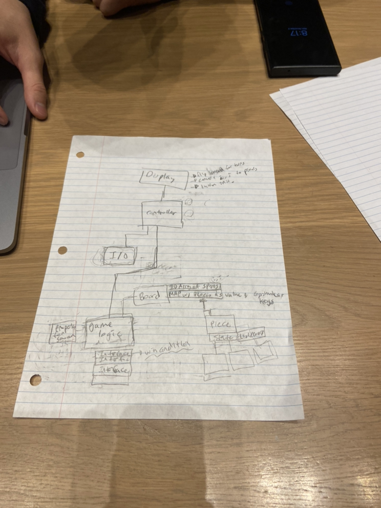

# Design Plan

## Author(s)
Amr Tagel-Din

## Primary Design Goals:
Each Chess Piece should be as flexible as possible: Despite the default rules of every chess piece,
it should be easy to 'break' those rules (examples: On what rank can a pawn promote? When can pawns
move two squares as opposed to one? How easily can we make it flexible so that a pawn can move, say, 
3 moves at once? Can we make pawns go sideways and backwards easily?). What does each piece look like
and can we easily change that. 

Each Chess Board should be as flexible as possible: Is any given "Square" (which extends from the
abstract 'spot' class) usable or not? Can we travel from side of the board to another side, 
like a toroidal grid? Can we make some squares into 'portals' that jump you to other squares?

If done successfully, it should be very easy to use this template to make new chess pieces and new 
chess boards, which is somewhat of the basis of making new chesss modes.
Those new modes would depend upon a flexible 'timer' system, a mode where you can purchase and place
your own pieces to start, a mode where you can move the other sides pieces and not just your own(for
example, to ruin their structure);

## Primary Architecture of the Design:
###What is open?
The type of game being played should be up to the user - ideally the ability to mix and match.
This includes any type of flexibility described above.
Each game logic can read in from a variety of different interfaces

###What is closed?
Chess games will not be extended past 2 dimensions or anything like that; for the most part, despite
changes in rules or numbers of players, we want these games to follow a relatively logical path/ flow.
The order of play will not change in a game

###Abstractions?
Abstract Classes/ Interfaces:
'Spots' (like squares)
'Board' size, shape, toroidal, etc
'Piece' (different in terms of logic)
'logic' (interfaces under gameLogic)
'Rules' (general rules for the game that are in play)

## Intended Design to handle goal/ High level Design Overview for API's

